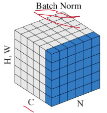
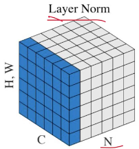
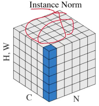
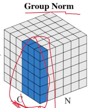

#### BatchNormalization
- 分别对每个通道中所有样本中的所有特征进行归一化

#### LayerNormalization
- 分别对每个样本中的所有通道/embedding的所有特征/token进行归一化

#### InstanceNormalization
- 分别对每个样本的每个通道中的所有特征进行归一化

#### GroupNormalization
- 分别对每个样本的每组通道中的所有特征进行归一化
